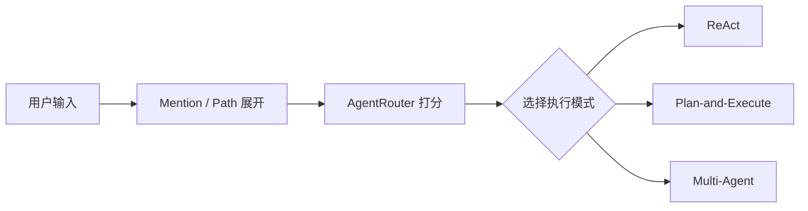

# Agent-Cli

这是一个围绕 **Agent 路由机制** 逐步演进的 Java Agent CLI 项目。

我的核心设想是：用户不应该总是手动判断任务该交给哪种 Agent。CLI 在接收普通输入后，应该先理解任务形态，再自动选择合适的执行路径，让简单任务保持轻量，让复杂任务进入规划，让可拆分任务进入多 Agent 协作。

## 当前方向

第一步先实现 Agent 自动路由：

- 简单问答、解释、单步读取走 `ReAct`
- 多步骤实现、修改、验证、文档任务走 `Plan-and-Execute`
- 多模块、多文件、可并行拆分的任务走 `Multi-Agent`
- `/plan`、`/team` 等显式命令仍然拥有最高优先级

这个阶段不追求一次做完整智能调度，而是先把“路由入口”建立起来。后续所有增强，例如失败分类、任务级 checkpoint、多 Agent 评审、工具安全分析、RAG 检索和长期记忆，都可以逐步挂到这个入口之后。

## 为什么先做路由

Agent CLI 的核心问题不是只有“能不能调用工具”，而是：

- 什么时候应该直接执行？
- 什么时候应该先规划？
- 什么时候值得拆成多个 Agent？
- 什么时候需要更强的验证、回滚和审查？

如果没有路由层，所有任务都会被塞进同一种执行模式。这样简单任务会变慢，复杂任务又容易缺少计划和边界。路由层是后续能力分层的基础。

## 路由模型

当前路由采用本地确定性规则，不额外调用 LLM，避免每次输入都增加成本和延迟。

基础判断信号包括：

| 信号 | 含义 |
|------|------|
| 变更意图 | 实现、新增、修改、修复、重构、创建、提交、push |
| 多步骤意图 | 先、然后、最后、一步一步、step by step |
| 项目范围 | 项目、代码库、模块、多个文件、架构、入口、链路 |
| 验证交付 | 测试、验证、文档、提交、推送、发布、部署 |
| 并行候选 | 同时、并行、分别、独立、多模块、多区域 |

## 当前状态

### 第一期：Agent 自动路由 MVP

- 新增 `AgentRouter`
- 普通输入会自动选择 `ReAct`、`Plan-and-Execute` 或 `Multi-Agent`
- 自动进入 Plan / Team 时会输出路由提示
- 已补充路由单元测试
- 已记录阶段实现文档

### 第二期优化：Plan 失败恢复增强

- 新增 `TaskFailureClassifier`
- 区分工具临时失败、参数错误、依赖错误、校验失败
- 根据分类结果分别选择重试、修正参数、重新规划或回滚
- 参数错误和工具临时失败会给当前任务追加 `PLAN_RECOVERY` 提示，让模型有机会在下一轮修正
- 依赖错误会触发 `Planner.replan(...)`，校验失败会尝试 Side-Git 回滚
- 详细记录见 [docs/phase-24-plan-failure-recovery.md](docs/phase-24-plan-failure-recovery.md)

详细设想见 [docs/agent-routing-vision.md](docs/agent-routing-vision.md)。

## 后续演进

后续会围绕这个路由入口逐步补齐能力：

1. 让路由结果参与更细粒度的任务规划。
2. 为每个任务节点增加 checkpoint 和 diff 审查。
3. 为 Multi-Agent 增加角色分工、评审者和评分机制。
4. 将 MCP、RAG、长期记忆、命令安全分析逐步接入路由决策。

这个仓库会按“先建立入口，再逐步增强”的方式推进。
