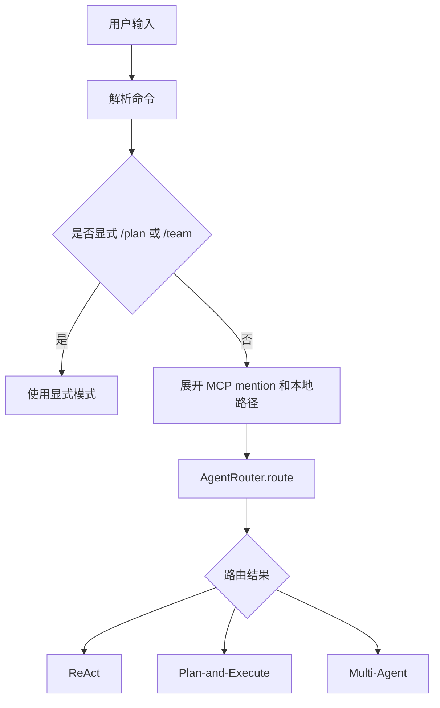

# Agent 路由设想

## 背景

Agent CLI 不应该只提供一种固定执行模式。真实任务有明显差异：有些只是简单解释，有些需要多步骤修改，有些天然可以拆分给多个 Agent 并行处理。

因此，这个项目的第一条主线是建立 Agent 路由机制：普通输入进入执行层之前，先由路由器判断任务形态，再选择合适的执行模式。

## 目标

路由层要解决三个问题：

1. 简单任务不要过度规划，保持响应速度。
2. 复杂任务不要直接硬做，要先计划、再执行、再验证。
3. 可拆分任务不要只靠单 Agent 串行处理，要为后续 Multi-Agent 协作留下入口。

当前阶段的目标是做一个保守、可解释、可测试的 MVP，而不是一次性做成完全智能的调度系统。

## 执行模式

### ReAct

适合简单任务：

- 问答
- 解释代码
- 单步读取文件
- 轻量分析

这类任务不需要额外规划，直接进入 ReAct 可以减少延迟。

### Plan-and-Execute

适合需要顺序推进的任务：

- 修改代码
- 新增功能
- 写测试
- 写文档
- 提交和推送

这类任务通常需要先拆步骤，再逐步执行，并在关键节点验证结果。

### Multi-Agent

适合有并行价值的任务：

- 多模块改造
- 多文件审查
- 前后端分别处理
- 实现者和评审者分工

当前 MVP 只负责把这类任务路由到 Team 入口，后续再逐步补齐更细的角色分工和评审机制。

## 路由原则

当前路由规则保持本地确定性，不额外调用 LLM。

这样做有几个原因：

- 成本低：不会因为每次输入都多一次模型请求。
- 延迟低：路由在本地快速完成。
- 行为可解释：每次路由都有分数和原因。
- 易测试：规则可以用单元测试覆盖。

## 基础评分

| 信号 | 加分 | 说明 |
|------|------|------|
| 变更意图 | `+2` | 实现、新增、修改、修复、重构、创建、提交、push |
| 多步骤意图 | `+2` | 先、然后、最后、一步一步、step by step |
| 项目范围 | `+2` | 项目、代码库、模块、多个文件、架构、入口、链路 |
| 验证交付 | `+1` | 测试、验证、文档、提交、推送、发布、部署 |
| 并行候选 | `+2` | 同时、并行、分别、独立、多模块、多区域 |
| 结构化输入 | `+1` | 多行输入或较长需求 |

选择规则：

| 条件 | 执行模式 |
|------|----------|
| `score <= 2` | `ReAct` |
| `score >= 3` | `Plan-and-Execute` |
| `score >= 6` 且存在并行候选 | `Multi-Agent` |

显式命令优先级最高：`/plan`、`/team` 不会被自动路由覆盖。

## CLI 流程



当自动路由选择 Plan 或 Team 时，CLI 会输出一行提示，方便用户知道为什么任务被升级：

```text
🧭 自动路由: Plan-and-Execute (score=5, reasons=change, multi_step, verify_or_ship)
```

## 当前实现边界

当前阶段只实现路由入口，不把所有后续设想一次塞进去。

暂不包含：

- 失败分类
- task-level checkpoint
- diff 合并策略
- 资源锁
- 多 Agent 评分和仲裁
- 基于 RAG 或长期记忆的语义路由

这些能力会在后续阶段逐步接入。

## 后续演进

后续可以按下面顺序推进：

1. 让路由结果影响计划粒度和验证强度。
2. 为 Plan-and-Execute 增加失败分类，例如环境失败、测试失败、权限失败、需求不明确。
3. 为每个任务节点加入 checkpoint，失败后可以回滚到节点级状态。
4. 为 Multi-Agent 增加 planner、worker、reviewer 三类角色。
5. 让 reviewer 对任务结果打分，低分时触发返工。
6. 将 MCP 工具、RAG 检索、长期记忆和命令安全策略纳入路由上下文。

## 相关文件

- `src/main/java/com/paicli/agent/AgentRouter.java`
- `src/main/java/com/paicli/cli/Main.java`
- `src/test/java/com/paicli/agent/AgentRouterTest.java`
- `docs/phase-23-agent-routing.md`
