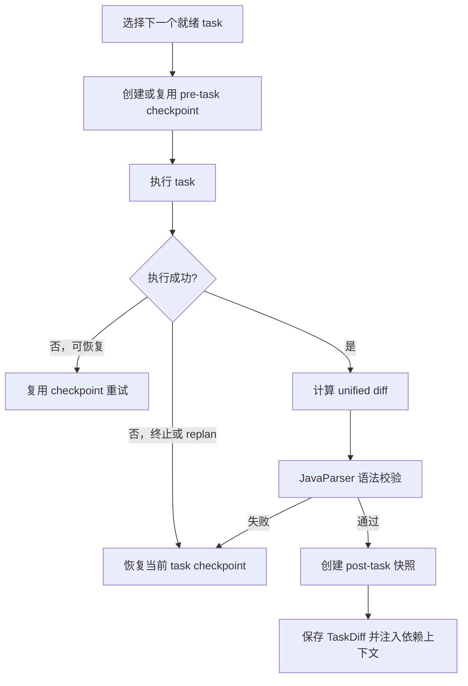

# 第三期优化：Plan 任务级 Checkpoint 与 Diff

## 目标

第二期已经能区分任务失败类型并选择重试、修正参数、重新规划或回滚，但回滚仍以整个 turn 为边界。第三期把 Side-Git 的保护范围下沉到 Plan task：

- task 首次执行前同步创建 `pre-task` checkpoint。
- task 成功后计算该 task 独立产生的 unified diff。
- 变更的 Java 文件通过语法校验后才保留。
- 后续依赖 task 可以读取前序成功 task 的 diff。
- task 最终失败时只恢复当前 task，不撤销前序成功改动。

## MVP 执行流程

Plan 每轮只执行一个就绪 task，以保证共享工作区中的 checkpoint 边界稳定。



## 核心类型

### `TaskCheckpoint`

记录 task id、Side-Git commit id、创建时间和可用状态。临时工具失败或参数修正触发重试时，继续复用最初 checkpoint，不把中间残留改动当成新基线。

### `TaskDiff`

记录：

- 变更文件列表
- 新增行数
- 删除行数
- unified diff

注入 LLM 时，元数据和补丁合计最多 12,000 字符，超出部分标记为 `diff truncated`。

### `TaskSyntaxValidator`

只校验 diff 中仍然存在的 `.java` 文件：

- 合法 Java 文件通过。
- JavaParser 返回语法问题时触发 `VALIDATION_FAILURE -> ROLLBACK`。
- 已删除 Java 文件和非 Java 文件不做语法解析。

## 精准回滚

Plan task 串行执行，因此 task 2 的 checkpoint 已包含 task 1 的成功改动。task 2 回滚时恢复到自己的 checkpoint：

```text
turn 开始
  task 1 checkpoint -> task 1 成功改动
  task 2 checkpoint -> task 2 失败改动
  task 2 rollback   -> 保留 task 1，撤销 task 2
```

`REPLAN`、校验失败和恢复次数耗尽都会先尝试恢复当前 task checkpoint。checkpoint 被关闭或创建失败时，任务仍可执行，但系统会明确报告精准回滚不可用，不会退回到自动 turn 级回滚。

## Side-Git 隔离修复

本期同时补充 linked worktree 回归保护。Side-Git 初始化不再使用会重写项目根 `.git` 指针的 JGit worktree 初始化方式，而是：

1. 在外置 `gitDir` 中按 bare 仓库初始化。
2. 将配置切换为 non-bare。
3. 显式设置项目 `worktree`。

这样普通仓库和 linked worktree 都不会被 Side-Git 修改 branch、HEAD、index 或 `.git` 指针。

## 边界

- MVP 为保证精准恢复，将 Plan task 改为串行执行。
- 只对 Java 文件做语法校验，不替代 Maven 编译和测试。
- diff 只注入当前 task 的直接或间接依赖，不注入无关 task。
- 不实现独立 worktree 并行、补丁合并或冲突交互。
- ReAct 和 Multi-Agent 仍保持原有执行方式。

## 相关文件

- `src/main/java/com/paicli/snapshot/TaskCheckpoint.java`
- `src/main/java/com/paicli/snapshot/TaskDiff.java`
- `src/main/java/com/paicli/snapshot/SideGitManager.java`
- `src/main/java/com/paicli/snapshot/SnapshotService.java`
- `src/main/java/com/paicli/plan/TaskSyntaxValidator.java`
- `src/main/java/com/paicli/agent/PlanExecuteAgent.java`

## 验证

```bash
mvn test -Dtest=PlanExecuteAgentTest,TaskFailureClassifierTest,TaskSyntaxValidatorTest,SideGitManagerTest,AgentRouterTest -DskipTests=false
mvn package -DskipTests
```

验证结果：

- 针对性回归共 28 个测试，0 failures、0 errors。
- `mvn package -DskipTests` 构建成功并生成 shaded JAR。
- 使用临时假 Key 输入 `/exit`，CLI 启动冒烟退出码为 0，未请求模型。

仓库原有 `mvn test -Pquick` 在当前 Windows 环境仍有与本期无关的临时目录权限、`F:\tmp` 缺失、CRLF 和图片路径基线失败，详见本期提交记录。
