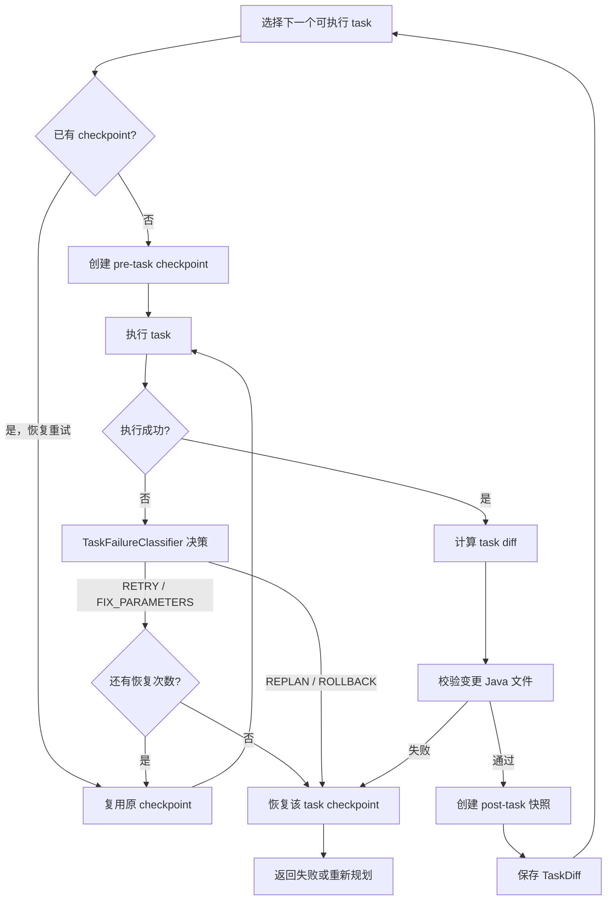

# 第三期设计：Plan 任务级 Checkpoint 与 Diff

## 背景

项目已有 turn 级 Side-Git 快照，可以在整轮 Agent 执行失败后恢复工作区。第二期又为 Plan 增加了失败分类与重试、参数修正、重新规划、回滚决策。

当前缺口是：Plan 中任意 task 失败时，回滚只能恢复整个 turn，可能一并撤销此前已经成功的 task。后续 task 也只能读取前序 task 的文本结果，无法直接获知其真实文件改动。

第三期把 Side-Git 的保护边界下沉到 Plan task，在不修改用户项目 `.git` 的前提下，提供任务级 checkpoint、diff、语法校验和精准回滚。

## 目标

1. 每个 Plan task 首次执行前同步记录工作区状态。
2. task 成功后计算该 task 独立产生的文件 diff。
3. 对变更的 Java 文件执行语法校验，校验通过后保留改动。
4. 将成功 task 的 diff 注入后续直接或间接依赖它的 task。
5. task 最终失败、需要重新规划或校验失败时，只撤销该 task 的改动。
6. 与现有 turn 快照共存，并继续保持 Side-Git 与用户仓库隔离。

## 非目标

- 不实现并行 task 的独立工作区或三方合并。
- 不修改用户项目的 branch、index、HEAD 或 stash。
- 不以 task 级语法校验替代整项目编译和测试。
- 不把完整的大型补丁无限制注入 LLM 上下文。
- 不改变 ReAct 和 Multi-Agent 的执行模型。

## 方案选择

### 方案 A：Side-Git task 事务层

在现有 `SnapshotService` 和 `SideGitManager` 上增加 `pre-task`、`post-task`、工作区 diff 与按 commit 恢复能力。

优点：

- 复用现有 JGit、排除规则和仓库隔离机制。
- 能覆盖新增、修改、删除文件。
- task checkpoint 与 turn checkpoint 可在同一历史中审计。

缺点：

- task 执行期间需要扫描工作区。
- 共享工作区无法安全支持可写 task 并行。

### 方案 B：文件复制快照

task 前复制项目文件，失败后复制回来。

优点是实现直接；缺点是磁盘开销大、增量能力弱，还需要另写排除、diff 和恢复逻辑。

### 方案 C：用户仓库 Git patch/stash

使用项目自身 Git 生成和反向应用补丁。

优点是工具成熟；缺点是会接触用户 Git 状态，对未跟踪文件和已有脏工作区也更难保证安全。

本期选择方案 A。

## 核心模型

### `TaskCheckpoint`

记录 task 事务的稳定基线：

- `taskId`
- `snapshotCommitId`
- `createdAt`
- `active`

同一个 task 因临时失败或参数错误重试时继续复用原 checkpoint，避免只回滚最后一次尝试。

### `TaskDiff`

记录成功 task 的文件影响：

- `taskId`
- `changedFiles`
- `additions`
- `deletions`
- `unifiedDiff`
- `truncated`

`TaskDiff` 提供面向 LLM 的格式化方法。上下文始终保留文件列表和增删统计，补丁部分按字符上限截断。

### `TaskSyntaxValidator`

根据 `TaskDiff.changedFiles` 校验当前工作区：

- 对存在的 `.java` 文件使用 JavaParser 解析。
- 删除的 Java 文件不执行解析。
- 非 Java 文件在本期不做语法解析。
- 任意 Java 解析错误都会返回校验失败及文件、行列和错误摘要。

## Side-Git 扩展

`SnapshotPhase` 增加：

- `PRE_TASK`
- `POST_TASK`

`SideGitManager` 增加以下能力：

- 创建 task 前后快照。
- 计算指定 checkpoint commit 到当前工作区的 unified diff。
- 恢复到指定 checkpoint commit。

恢复前仍创建 `pre-restore` 快照，保留恢复动作的反悔点。恢复只写入 Side-Git 跟踪且未被排除的文件，不触碰用户项目 `.git`。

`SnapshotService` 为 Plan 暴露同步 task API。task 前快照必须在执行工具前完成；task 后 diff、校验、快照也按顺序同步完成。

## Plan 执行流程

第三期启用 task checkpoint 后，Plan task 统一串行执行。这样后一个 task 的 checkpoint 一定包含所有前序成功 task 的改动，回滚后一个 task 时不会撤销前序成果。

### 恢复语义

- `RETRY`、`FIX_PARAMETERS`：在允许次数内不回滚，继续使用原 checkpoint；成功后生成包含全部尝试改动的 diff。
- `REPLAN`：先恢复失败 task 的 checkpoint，再调用 `Planner.replan(...)`。
- `ROLLBACK`：恢复失败 task 的 checkpoint并结束当前 Plan。
- 重试耗尽或其他终止失败：恢复失败 task 的 checkpoint，再执行现有失败收尾逻辑。
- checkpoint 不可用：不伪造成功回滚，输出明确的保护不可用说明。

## Diff 上下文

Plan 内维护 `taskId -> TaskDiff` 映射，不修改 Planner 生成的 DAG 模型。

构建 task 上下文时，查找当前 task 的直接和间接依赖，只注入这些依赖 task 的 diff。无依赖关系的已完成 task 不进入上下文。

单个 task 上下文中的 diff 总长度最多为 12,000 字符：

1. 优先保留 task id、变更文件和增删统计。
2. 其后按依赖顺序追加 unified diff。
3. 超过上限时截断补丁并标记 `diff truncated`。

该上下文只帮助后续 task 理解已落地改动，不替代依赖 task 的文本执行结果。

## 失败降级

Side-Git 可通过配置关闭，快照创建也可能因文件系统问题失败。本期沿用现有“快照故障不阻断 Agent 主流程”的兼容原则：

- task 继续执行。
- 输出 checkpoint/diff/精准回滚不可用的警告。
- task 最终失败时不回退到 turn 级自动回滚，避免意外撤销前序成功 task。
- turn 级手动 `/restore` 能力保持不变。

## 并发约束

本期将 Plan 的 DAG 就绪 task 按 `executionOrder` 串行执行。原因是多个 task 共享同一工作区时，任一 task 恢复基线都可能覆盖同时运行的兄弟 task。

未来若恢复 task 并行，需要为每个 task 提供独立 worktree 或隔离文件系统，并增加 diff 合并和冲突处理。本期不预埋不完整的并行抽象。

## 测试设计

### Side-Git

- checkpoint 到工作区的 diff 能识别新增、修改和删除文件。
- task 恢复能回到指定 checkpoint。
- 恢复失败 task 不撤销 checkpoint 之前已存在的文件改动。
- task phase 能被快照列表正确解析。

### 语法校验

- 合法 Java 文件通过。
- 非法 Java 文件返回定位明确的失败。
- 删除文件和非 Java 文件不产生误报。

### Plan 集成

- 成功 task 保存 `TaskDiff`，依赖 task 能在输入中看到 diff。
- 无依赖 task 看不到其他 task 的 diff。
- 参数修正或临时失败重试复用最初 checkpoint。
- 校验失败触发 task 级恢复。
- `REPLAN` 前先恢复失败 task。
- 后续 task 失败时，前序成功 task 的文件改动仍保留。
- 同一批就绪 task 按执行顺序串行运行。

## 文档联动

实现完成后同步更新：

- `README.md`：增量增加“第三期优化”状态。
- `AGENTS.md`：更新已交付阶段、Plan 执行约束和验证路径。
- `docs/phase-25-task-checkpoint-diff.md`：记录本期行为、边界和验证命令。
- `docs/phase-24-plan-failure-recovery.md`：把校验失败回滚说明更新为 task 级 checkpoint。
- `docs/phase-18-side-history-snapshot.md`：注明原有“不做 task 快照”限制已被第三期覆盖。

## 验收标准

1. Side-Git 启用且 checkpoint 创建成功时，Plan 每个 task 首次执行前都有独立 checkpoint，重试不重置基线。
2. checkpoint 可用时，成功 task 生成可审计 diff，Java 语法通过后才提交 `post-task` 快照。
3. 后续依赖 task 能收到受限长度的 diff 上下文。
4. checkpoint 可用时，task 失败后的恢复不撤销此前成功 task 的改动。
5. 用户项目 `.git` 的 branch、HEAD 和 index 不发生变化。
6. 相关单元测试、Maven 编译打包和 CLI 启动冒烟测试通过。
