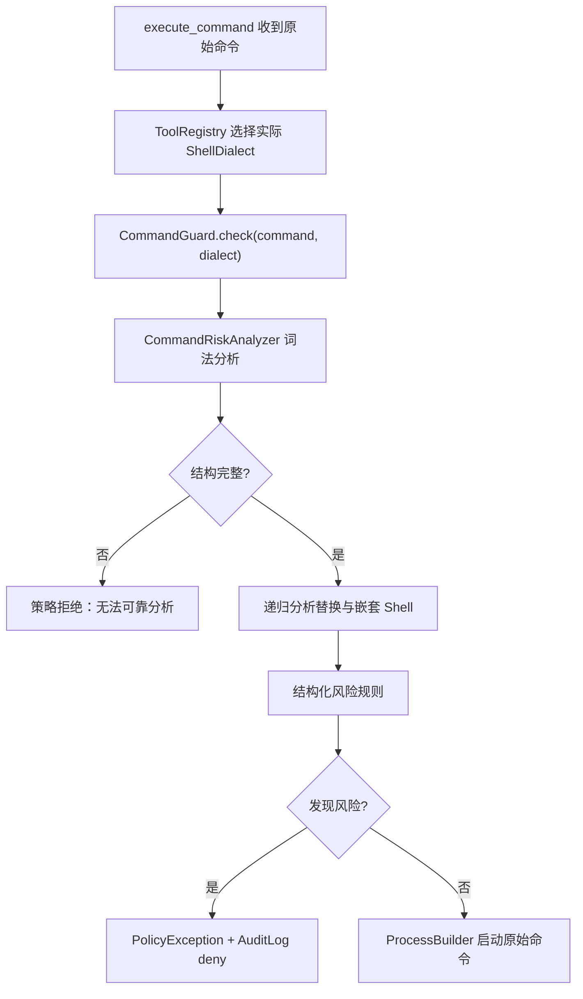

# 第四期设计：结构化命令风险分析

## 背景

PaiCLI 的 `execute_command` 在真正启动 Shell 前由 `CommandGuard` 做策略拒绝。现有实现把整条命令压缩空白后依次匹配正则黑名单，可以拦截常见破坏性命令，但存在两个问题：

1. 不理解引号、转义、命令段、管道和重定向，容易把普通字符串误判成命令。
2. 风险规则与 Shell 文本格式紧耦合，参数拆分、嵌套 Shell 和组合命令可能绕过规则。

项目在 Windows 默认使用 PowerShell，可通过 `PAICLI_WINDOWS_SHELL=cmd` 切换到 cmd；其他平台使用 Bash。因此本期不能只覆盖 POSIX Shell。

## 目标

1. 新增 `CommandRiskAnalyzer`，把命令解析为可审计的结构，再基于结构判断风险。
2. 支持 Bash、PowerShell、cmd 三种实际执行方言。
3. 识别命令、参数、命令段连接符、管道、重定向和命令替换。
4. 递归分析命令替换和显式嵌套 Shell。
5. 保留 `CommandGuard` 的策略入口、拒绝原因和 HITL/审计集成。
6. 降低引号文本误报，并堵住参数变体、组合命令和嵌套命令绕过。

## 非目标

- 不实现 Bash、PowerShell 或 cmd 的完整语法树。
- 不展开环境变量、通配符、别名、函数、profile 或外部脚本内容。
- 不以静态分析替代进程沙箱、最小权限或 HITL。
- 不默认阻止所有网络命令、包管理器或普通文件操作。
- 不改变 `execute_command` 当前选择 Shell 和启动进程的行为。

## 方案选择

### 方案 A：方言感知的确定性词法状态机

逐字符扫描命令，依据当前 Shell 方言处理引号和转义，生成命令段、参数、连接符、管道、重定向和替换节点。

优点：

- 不增加运行时依赖。
- 可同时覆盖项目实际使用的三种 Shell。
- 规则直接读取结构，便于测试、解释和扩展。
- 可以保留原有策略层 API，改动范围可控。

缺点：

- 只覆盖安全分析需要的语法共同子集。
- 新增 Shell 语法时需要显式扩展状态机。

### 方案 B：引入第三方 Shell Parser

优点是 POSIX Shell 语法成熟；缺点是常见 Java 库通常不支持 PowerShell 和 cmd，仍需维护第二套、第三套解析逻辑，并引入依赖和 AST 适配成本。

### 方案 C：先切命令段，再沿用正则

实现最小，但参数、引号和嵌套命令仍以字符串形式匹配，无法真正解决误报与绕过问题。

本期选择方案 A。

## 核心模型

### `ShellDialect`

枚举值：

- `BASH`
- `POWERSHELL`
- `CMD`

`ToolRegistry` 以与 `shellCommand(...)` 相同的环境判断选择方言，并将方言传给 `CommandGuard`。保留 `CommandGuard.check(String)` 作为兼容入口，它使用当前运行环境对应的方言。

### `CommandAnalysis`

表示一次完整分析：

- 原始命令。
- Shell 方言。
- 顶层 `CommandSegment` 列表。
- 递归发现的命令替换和嵌套 Shell 分析结果。
- 首个 `CommandRisk`，无风险时为空。

### `CommandSegment`

表示一个可执行命令单元：

- 规范化后的可执行文件名。
- 参数列表。
- 重定向列表。
- 与前后段的连接关系。
- 所属管道编号和位置。

可执行文件规范化只取路径末尾，并移除 Windows 常见可执行扩展名，使 `/usr/bin/sudo`、`sudo.exe` 和 `sudo` 使用同一规则。

### `Redirection`

记录：

- 文件描述符。
- 操作符，例如 `<`、`>`、`>>`、`2>`、`2>&1`。
- 目标 token。

### `CommandRisk`

记录稳定的规则标识和面向用户的拒绝原因。`CommandGuard` 返回首个风险原因，以兼容现有 `String` 返回契约。

## 词法分析

分析器使用单次线性扫描和显式状态，不在整条命令上做风险正则匹配。

### 公共结构

三种方言共同识别：

- 空白参数边界。
- 命令段连接符：`;`、换行、`&&`、`||`。
- 管道：`|`。
- 重定向：`<`、`>`、`>>` 及文件描述符前缀。
- 双引号内文本。
- `$(...)` 命令替换。

### 方言差异

- Bash：单引号、双引号、反斜杠转义、反引号命令替换。
- PowerShell：单引号、双引号、反引号转义、`$(...)` 子表达式；子表达式内容按 PowerShell 递归分析。
- cmd：双引号、脱字符 `^` 转义、单个 `&` 命令连接符；单引号不作为引用符。

引号和转义后的控制字符只属于当前 token，不切分命令。未闭合引号、未闭合替换或缺少重定向目标视为无法可靠分析，策略层保守拒绝。

## 递归分析

以下内容进入递归分析：

1. Bash 的 `$()` 和反引号。
2. PowerShell 的 `$()`。
3. `sh`、`bash`、`zsh`、`fish` 的 `-c` 参数。
4. `powershell`、`pwsh` 的 `-Command` 参数。
5. `cmd` 的 `/c` 参数。

递归深度设置固定上限，超过上限保守拒绝，避免构造命令造成分析器资源消耗。

## 风险规则

本期迁移并增强现有规则：

- `sudo`：按可执行文件识别，不匹配普通参数文本。
- `rm`：组合分析 `-r`/`-R`/`--recursive` 与 `-f`/`--force`，目标为根目录、用户目录或其通配展开入口时拒绝。
- `mkfs*`：按可执行文件前缀识别。
- `dd`：参数中输出目标指向 `/dev/*` 时拒绝。
- fork bomb：保留一个针对语法 token 序列的专用检测器。
- 下载后执行：管道前段为 `curl`/`wget`，后段为 Shell 解释器时拒绝。
- `find`：搜索根目录或用户目录时拒绝。
- `chmod`：递归设置 `777` 且目标为根目录或用户目录时拒绝。
- 电源命令：`shutdown`、`reboot`、`halt`、`poweroff`。
- 设备重定向：输出重定向目标为 Unix 块设备或 Windows 物理磁盘设备时拒绝。

普通字符串中的危险词不触发规则，例如 `echo "sudo rm -rf /"`。但传给 `bash -c`、`powershell -Command` 或 `cmd /c` 的字符串会作为命令再次分析。

## 集成流程

分析器只决定是否拒绝，不重写原始命令。通过检查后，`ProcessBuilder` 仍接收用户原文，避免词法结果改变执行语义。

## 失败与边界

- 空命令沿用当前行为。
- 解析失败返回稳定原因，不抛出未处理异常。
- 递归深度、段数量和 token 数设置上限，超限保守拒绝。
- 方言选择必须与实际 Shell 启动选择复用同一判断，不能各自推断。
- 分析器仍是辅助安全层；未命中不代表命令安全，HITL 和用户判断继续作为主防线。

## 测试设计

### 结构测试

- 三种方言正确切分命令段和参数。
- 引号中的 `;`、`|`、`>` 不切分。
- Bash 反斜杠、PowerShell 反引号、cmd 脱字符正确转义。
- 管道与重定向形成正确结构。
- `$()`、Bash 反引号和嵌套 Shell 被递归发现。
- 未闭合结构和资源上限返回分析失败。

### 风险测试

- 保留现有全部拒绝和放行行为。
- `echo "sudo rm -rf /"` 不误报。
- `echo ok && rm -r -f /` 被拒绝。
- `bash -c "rm --recursive --force /"` 被拒绝。
- `powershell -Command "shutdown /s"` 被拒绝。
- `cmd /c "shutdown /s"` 被拒绝。
- `curl ... | bash` 被拒绝，但 `curl ... -o file` 放行。
- 输出重定向到设备被拒绝，普通文件重定向放行。
- 路径形式可执行文件和 `.exe` 后缀不能绕过规则。

### 集成测试

- `ToolRegistry` 将当前实际方言传入策略层。
- 策略拒绝继续返回现有提示并记录审计。
- 安全命令仍在项目目录中执行。

## 文档联动

实现完成后同步更新：

- `README.md`：增加“第四期优化”及状态。
- `AGENTS.md`：把 `CommandGuard` 的描述更新为结构化辅助防线。
- `docs/phase-26-command-risk-analysis.md`：记录实现、边界、测试和面试讲解要点。
- CLI 帮助中的“命令黑名单”改为“结构化命令风险分析”。

## 验收标准

1. Bash、PowerShell、cmd 都使用与实际执行一致的方言分析。
2. 风险判断基于命令结构，不再对整条命令执行黑名单正则扫描。
3. 管道、重定向、命令替换和嵌套 Shell 可被识别和递归分析。
4. 现有危险命令仍被拒绝，新增绕过用例被覆盖，引用文本误报被消除。
5. HITL、审计和 `CommandGuard.check(String)` 兼容行为不被破坏。
6. 相关单元测试、完整 Maven 测试、打包和 CLI 启动冒烟测试通过。
